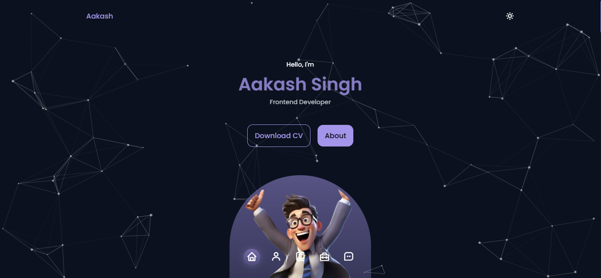
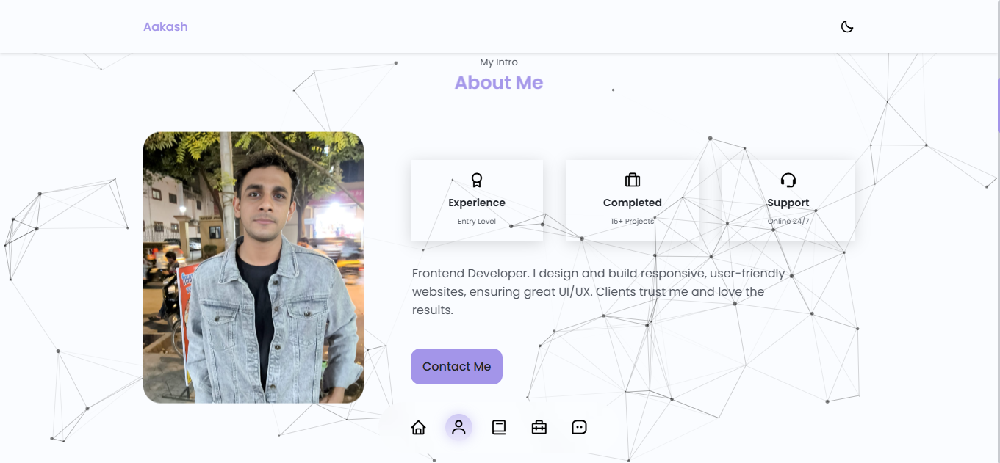

# 🌟 Aakash Portfolio

This is my personal **animated portfolio website** built using HTML, CSS, JavaScript, and [Particles.js].  
It showcases my **about, projects, and skills** in a creative and interactive way.

---

## 🖼️ Preview
### 🌑 Dark Mode

### ☀️ Light Mode

---

## ✨ Features
- 🎨 Modern and responsive design  
- 🌀 Smooth animations and transitions  
- 🌌 Particles.js interactive background  
- 📱 Mobile-friendly layout  
- 📂 Sections: About Me, Skills, Projects, Contact  

---

## 🚀 Tech Stack
- HTML5, CSS3, JavaScript  
- Particles.js  

---

## 🌐 Live Website
👉 [Visit Portfolio](https://aakashsportfolio.netlify.app)

---

## 👤 Connect with Me
- GitHub: [AakashSingh0388](https://github.com/Aakashsingh0388)  
- LinkedIn: [Aakash Singh](https://www.linkedin.com/in/aakash-singh-7b8416318?utm_source=share&utm_campaign=share_via&utm_content=profile&utm_medium=android_app)  
- Email: [aakashsingh1937@gmail.com](mailto:aakashsingh1937@gmail.com)  

---

© 2025 Aakash Singh. All rights reserved.
